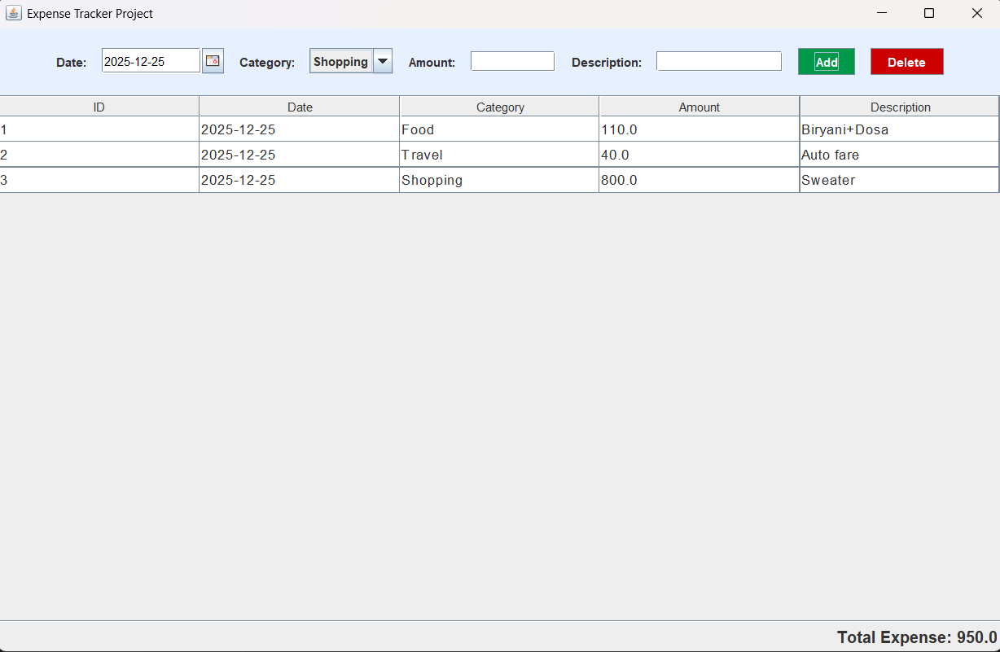

# 💰 Personal Expense Tracker System

A robust desktop application built using **Java Swing** and **MySQL** to manage daily financial records effectively. This project implements full **CRUD (Create, Read, Update, Delete)** operations and provides a user-friendly interface for tracking expenses.

## 🚀 Features

- **Add Expenses:** Log daily expenses with specific details (Date, Category, Amount, Description).
- **Smart Date Picker:** Integrated **JCalendar** for easy and accurate date selection.
- **Expense History:** View all past transactions in a clean, tabular format.
- **Delete Records:** Remove incorrect or outdated entries from the database.
- **Real-time Total:** Automatically calculates and displays the total expenditure.
- **Data Persistence:** Uses **MySQL Database** to store data permanently.

## 🛠️ Tech Stack

- **Language:** Java (JDK 17+)
- **GUI Framework:** Java Swing (JFrame, JTable, JPanel)
- **Database:** MySQL (8.0)
- **Database Connectivity:** JDBC (MySQL Connector/J)
- **Third-party Libraries:** JCalendar (v1.4)
- **IDE:** VS Code / Eclipse / IntelliJ

## 📸 Screenshots


## ⚙️ Setup & Installation

Follow these steps to run the project on your local machine:

### 1. Prerequisites
Ensure you have the following installed:
- Java Development Kit (JDK)
- MySQL Server & Workbench
- VS Code (with Java Extension Pack)

### 2. Database Setup
Open **MySQL Workbench** and run the following SQL script to create the database and table:

```sql
CREATE DATABASE expense_tracker_db;

USE expense_tracker_db;

CREATE TABLE expenses (
    id INT AUTO_INCREMENT PRIMARY KEY,
    date DATE,
    category VARCHAR(50),
    amount DOUBLE,
    description VARCHAR(255)
);